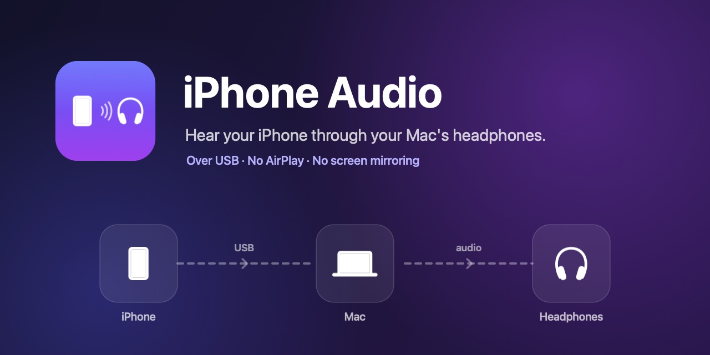
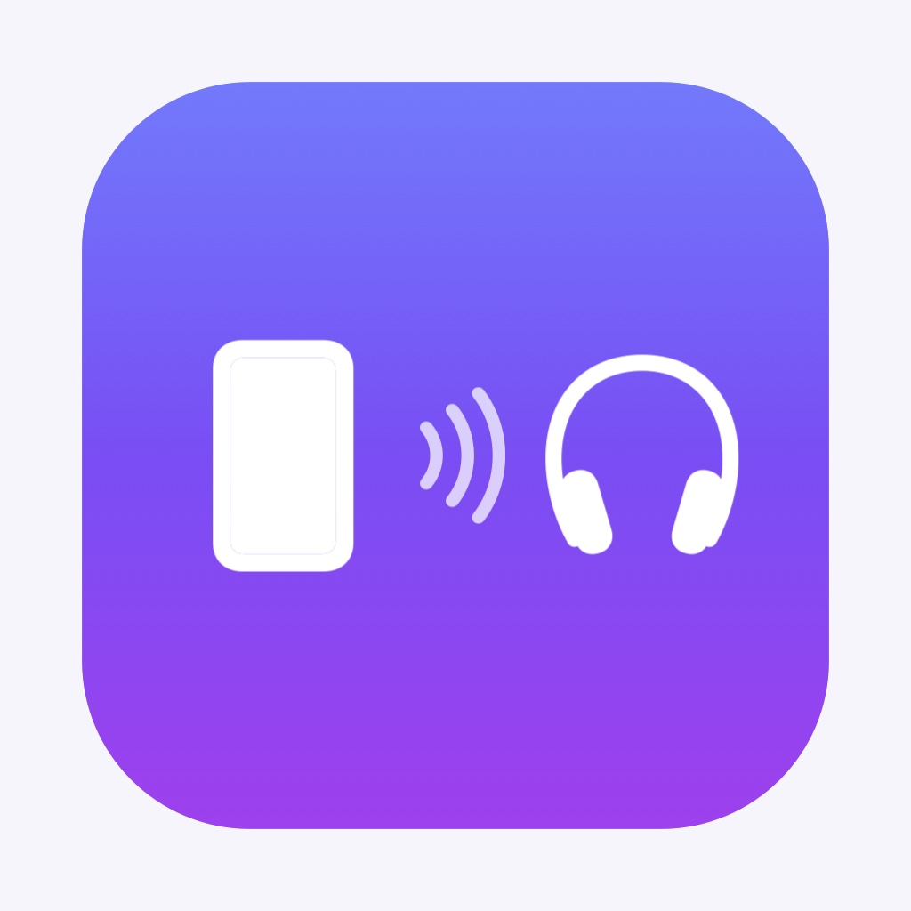

<p align="center">
  
</p>

#  iPhone Audio

Plays your iPhone's sound on your Mac's headphones. The iPhone is connected with a USB cable.

## Use

1. Connect the iPhone to the Mac with a cable.
2. Open the app. An iPhone icon appears in the menu bar.
3. The first time, Audio MIDI Setup opens. Click **Enable** under your iPhone.
4. Play something on the iPhone. You hear it on the Mac.

## Microphone icon

macOS shows the orange microphone icon while the app runs. The app does not use any microphone. macOS counts the iPhone's sound as an input, and it shows this icon for every input.

Keep **Mic Mode** on **Standard**. **Voice Isolation** makes music sound bad.

## Permissions

- **Microphone:** macOS needs it to read the iPhone's sound.
- **Accessibility (optional):** used to point at the Enable button.

## Build

```sh
./build.sh
```

The app is installed to `~/Applications/iPhone Audio.app`.

## Author

Made by [productdevbook](https://productdevbook.com).

## License

[MIT](LICENSE)
